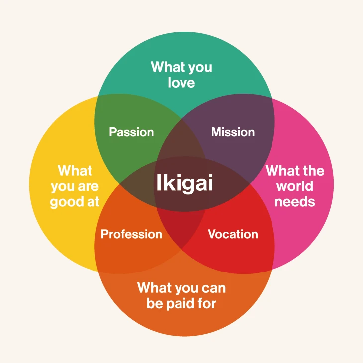
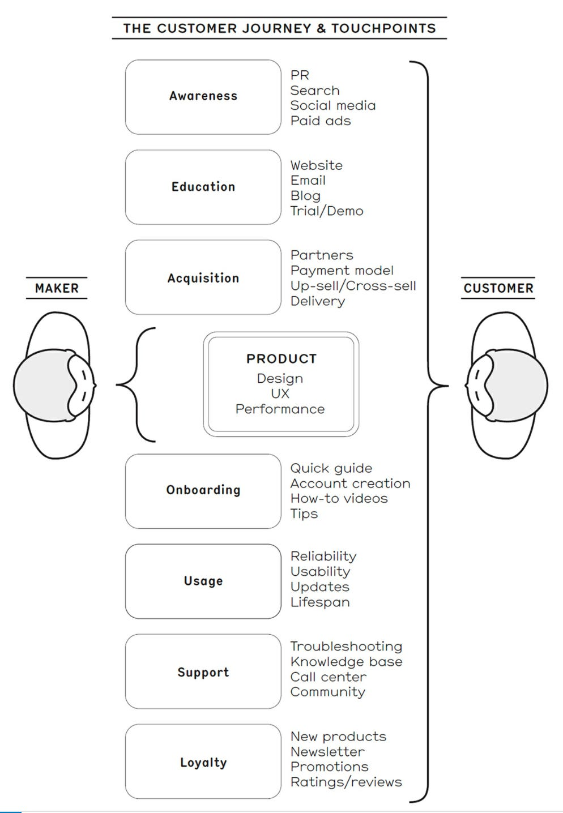

# Why? / Ikigai
First, a brief tangent. I have found the concept of ikigai very helpful when evaluating what things I work on.  to work on. 

Perhaps you’ve also wondered, does something exist to fix this? If not, is the problem technical, economic, political? All of the above?

While I do think that I'm not the only person that would like one, 

In this video series, I’m going to attempt to give an introduction to the glare reduction space, detail the concepts behind a potential solution within it, and give a very incomplete introduction to invention and business along the way. It should be accessible and at least mildly interesting for everyone, but if you'd rather not stick around, no problem! Just help us out by taking the survey in the pinned comment on your way out! Thanks, Bye!

<wave> ... <beat> ... <smirk, breaking 4th wall>

Glad you decided to stick around :) This should be a really fun interactive experience! Feel free to leave a comment as we go along, and as I make errors I'll put them in the pinned comment.

# “Table of Contents”:
For this video, we

# Demand Validation
If you are thinking about starting a business, one of the key first assumptions to test is whether enough people care enough about the problem to pay you enough money to solve it well enough for them. This is called "Demand Validation" or "customer discovery", and is especially relevant when making hardware since the development and distribution cost is so high! There are lots of techniques for this, but one I like is a book called "The Mom Test". It illustrates the many ways you can accidentally bias your potential customers' answers when talking with them, for a number of different reasons.

We're going to practice! Rather than talking about your cool idea (show briefly, but hex pixel it?), it's much more caring and efficient to find out if the other person has actually taken steps that show they would be a ideal customer!

These interviews are way more fun in person

https://commoncog.com/the-heart-of-innovation-why-startups-fail/

Rather than talk about the cool tech first, :)

I've created a survey  talking with them directly. want you to be happy will unintentionally give you false positive signals as to bias your to see you happy will conversations can give you false positive signals if you don't approach do them carefully, since centers around a conversation might go with how to ask questions It's a great book, but the core essence is not to  where you have a low-key conversation with what you think are your potential customers. But, importantly, you care much  a key concept for "builders"  (I like the concept of "pretotyping"), but we're oging to try a survey.  For this space, it's an open question The problem of glare reduction Unlike a lot of other people, I like the projects I spend my time on to be useful for 

The point of this video is less about the technology and more about market analysis, which is an unknown for me still, and *you* can help! Share the video with _________, and I’ll share the summary of the survey in a future video! Do enough people want to pay enough money for the solution I am proposing? Is it a “tar pit” idea or just a difficult problem to solve?

It's important to try to be honest with the survey because It represents a lot of potential work to bring the product to market. I or other people would rather find out now that it won't work economically or it's not that big of an issue and it's good to document that! Lots of things arent worth making a product around, just like lots of things are in demand but the technical/economic side isn't able to meet it!

Probably also show other existing solutions if they haven’t tried or thought about them yet. 

What is the problem?

